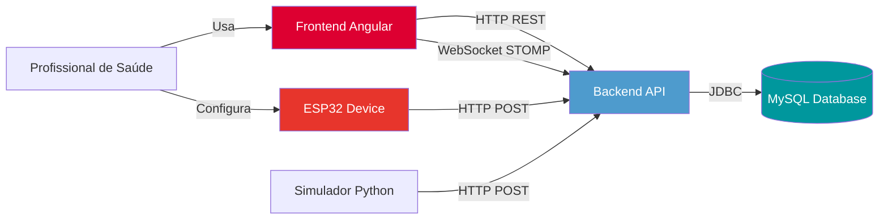

# InfraMed - Interface de Monitoramento de Pacientes

**Interface web moderna e responsiva para o sistema de gestão hospitalar InfraMed. Desenvolvida para oferecer uma experiência de usuário intuitiva e eficiente, permitindo o monitoramento de pacientes e a administração de recursos hospitalares em tempo real.**

---

<p align="center">
  
  
  
  
  
</p>

---

## 📋 Sumário

- [📖 Sobre o Projeto](#-sobre-o-projeto)
- [✨ Principais Funcionalidades](#-principais-funcionalidades)
- [🛠️ Tecnologias Utilizadas](#️-tecnologias-utilizadas)
- [🏗️ Estrutura do Projeto](#️-estrutura-do-projeto)
- [🚀 Como Executar](#-como-executar)
- [🌐 Ecossistema Completo](#-ecossistema-completo)
- [🔐 Autenticação](#-autenticação)
- [💡 Contexto do Projeto](#-contexto-do-projeto)
- [✍️ Autor](#️-autor)

---

## 📖 Sobre o Projeto

O frontend do **InfraMed** é a interface visual do sistema, construída como uma **Single-Page Application (SPA)** com Angular. Ele consome a API RESTful do backend para fornecer uma plataforma centralizada onde a equipe de saúde pode gerenciar pacientes, funcionários, quartos e atendimentos de forma ágil e segura.

A interface foi projetada com foco na **usabilidade**, **acessibilidade** e **responsividade**, garantindo que os profissionais de saúde possam acessar informações críticas rapidamente em qualquer dispositivo.

### 🎯 Objetivo

Criar uma interface moderna e intuitiva que permita:
- Gestão eficiente de recursos hospitalares
- Acesso rápido a informações de pacientes
- Monitoramento em tempo real via WebSocket
- Experiência responsiva em todos os dispositivos
- Controle de acesso baseado em perfis de usuário

---

## ✨ Principais Funcionalidades

### Gestão de Recursos
- **Dashboard Intuitivo**: Visualização consolidada de status de quartos e alertas críticos
- **CRUD de Pacientes**: Cadastro, consulta, edição e remoção com validação de CPF
- **CRUD de Funcionários**: Gestão de médicos, enfermeiros e equipe de saúde
- **CRUD de Quartos**: Controle de disponibilidade e capacidade
- **CRUD de Atendimentos**: Registro de internações com diagnósticos CID-10

### Segurança e Controle
- **Autenticação JWT**: Login seguro com tokens de acesso e renovação
- **Controle por Perfil**: Interface adaptativa baseada em roles (ADMIN, MEDICO, ENFERMEIRO, etc.)
- **Guards de Rota**: Proteção de páginas por autenticação e permissão
- **Logout Seguro**: Limpeza de sessão e tokens

### Comunicação em Tempo Real
- **WebSocket Integration**: Notificações instantâneas de eventos críticos
- **Alertas Push**: Avisos visuais para leituras anormais de sensores
- **Histórico de Leituras**: Visualização de dados de monitoramento

### Experiência do Usuário
- **Design Responsivo**: Adaptação automática para desktop, tablet e mobile
- **Material Design**: Interface moderna seguindo guidelines do Google
- **Validação em Tempo Real**: Feedback imediato durante preenchimento de formulários
- **Loading States**: Indicadores de carregamento durante operações
- **Mensagens de Feedback**: Confirmações e erros através de snackbars

---

## 🛠️ Tecnologias Utilizadas

### Core
- **Angular 20.3.10**: Framework SPA com arquitetura baseada em componentes
- **TypeScript 5.8.3**: Superset de JavaScript com tipagem estática
- **Angular CLI 20.3.9**: Ferramenta de linha de comando para desenvolvimento

### UI e Estilização  
- **Angular Material 20.2.12**: Componentes Material Design prontos para uso
- **CSS**: Estilização pura para máxima compatibilidade
- **Responsive Design**: Layout adaptável via flexbox e media queries

### Comunicação
- **RxJS**: Programação reativa para gerenciar fluxos assíncronos
- **HttpClient**: Cliente HTTP nativo do Angular
- **WebSocket (STOMP/SockJS)**: Comunicação bidirecional em tempo real

### Validação
- **Reactive Forms**: Formulários reativos com validação dinâmica
- **Angular Validators**: Validadores nativos e customizados

---

## 🏗️ Estrutura do Projeto

O projeto segue uma **arquitetura organizada por features** com separação clara de responsabilidades:

```
InfraMed-Front-End/
├── .vscode/                    # Configurações do VS Code
├── public/                     # Assets públicos
├── src/
│   ├── app/
│   │   ├── config/            # Configurações da aplicação
│   │   │   └── API_CONFIG.ts  # URLs do backend e WebSocket
│   │   ├── core/              # Módulo central
│   │   │   ├── enum/          # Enumerações (roles, status, etc.)
│   │   │   ├── guard/         # Guards de autenticação e autorização
│   │   │   ├── interceptor/   # Interceptors HTTP (JWT, Error)
│   │   │   ├── services/      # Serviços globais
│   │   │   └── types/         # Tipos e interfaces TypeScript
│   │   ├── layout/            # Componentes de layout
│   │   │   ├── footer/        # Rodapé
│   │   │   └── toolbar-sidenav/ # Barra de navegação e menu lateral
│   │   ├── pages/             # Páginas da aplicação
│   │   │   ├── atendimentos/  # Gestão de atendimentos
│   │   │   ├── funcionarios/  # Gestão de funcionários
│   │   │   ├── home/          # Dashboard principal
│   │   │   ├── leituras/      # Visualização de leituras de sensores
│   │   │   ├── login/         # Página de autenticação
│   │   │   ├── notificacoes/  # Central de notificações
│   │   │   ├── pacientes/     # Gestão de pacientes
│   │   │   ├── quartos/       # Gestão de quartos
│   │   │   └── usuarios/      # Gestão de usuários do sistema
│   │   ├── app.component.*    # Componente raiz
│   │   ├── app.config.ts      # Configuração do módulo principal
│   │   ├── app.routes.ts      # Configuração de rotas
│   │   └── app.spec.ts        # Testes do componente raiz
│   ├── assets/                # Imagens, ícones, etc.
│   ├── index.html             # HTML principal
│   ├── main.ts                # Bootstrap da aplicação
│   └── styles.css             # Estilos globais
├── .editorconfig              # Configuração do editor
├── .gitignore                 # Arquivos ignorados pelo Git
├── angular.json               # Configuração do Angular
├── package.json               # Dependências do projeto
├── tsconfig.json              # Configuração do TypeScript
└── README.md                  # Este arquivo
```

### Organização por Camadas

**1. Config (Configuração)**
- `API_CONFIG.ts`: Centraliza URLs da API REST e WebSocket
  ```typescript
  baseUrl: 'http://localhost:8080/api'
  wsUrl: 'http://localhost:8080/ws'
  ```

**2. Core (Núcleo)**
- **enum/**: Enumerações do sistema (Roles, Status, Tipos)
- **guard/**: Proteção de rotas
  - `AuthGuard`: Verifica autenticação
  - `RoleGuard`: Verifica permissões
- **interceptor/**: Manipulação de requisições HTTP
  - `JwtInterceptor`: Adiciona token JWT automaticamente
  - `ErrorInterceptor`: Trata erros globalmente
- **services/**: Serviços de infraestrutura
  - `AuthService`: Autenticação e gerenciamento de tokens
  - `WebSocketService`: Comunicação em tempo real
- **types/**: Interfaces e tipos TypeScript

**3. Layout (Estrutura Visual)**
- **footer/**: Rodapé da aplicação
- **toolbar-sidenav/**: Barra superior e menu lateral com navegação

**4. Pages (Páginas/Features)**
Cada feature contém seus próprios componentes, services e models:

- **atendimentos/**: CRUD de atendimentos médicos
- **funcionarios/**: Gestão de equipe de saúde
- **home/**: Dashboard com resumo e estatísticas
- **leituras/**: Visualização de dados de sensores IoT
- **login/**: Autenticação de usuários
- **notificacoes/**: Central de alertas em tempo real
- **pacientes/**: CRUD de pacientes
- **quartos/**: Gestão e alocação de quartos
- **usuarios/**: Administração de usuários do sistema

### Serviços Principais

**Autenticação e Segurança**
- `AuthService`: Login, logout, refresh token, verificação de permissões
- `AuthGuard`: Proteção de rotas privadas
- `RoleGuard`: Controle de acesso por perfil

**Gestão de Recursos**
- `PacienteService`: CRUD de pacientes
- `FuncionarioService`: CRUD de funcionários
- `QuartoService`: CRUD e alocação de quartos
- `AtendimentoService`: CRUD de atendimentos

**Monitoramento**
- `LeituraService`: Consulta de dados de sensores
- `NotificacaoService`: Gerenciamento de alertas
- `WebSocketService`: Conexão em tempo real com backend

**Administração**
- `UsuarioService`: Gerenciamento de usuários do sistema

---

## 🚀 Como Executar

### Pré-requisitos

- **Node.js 20.19.0** ou superior ([Download](https://nodejs.org/))
- **Angular CLI 20.3.9**: 
  ```bash
  npm install -g @angular/cli@20.3.9
  ```
- **Git** ([Download](https://git-scm.com/))
- **Backend InfraMed** rodando ([Repositório](https://github.com/matheus05dev/BackendMonitoramentoPacientes))

### Instalação e Execução

1. **Clone o repositório:**
   ```bash
   git clone https://github.com/matheus05dev/InfraMed-Front-End
   cd InfraMed-Front-End
   ```

2. **Instale as dependências:**
   ```bash
   npm install
   ```
   
   Se houver problemas de compatibilidade:
   ```bash
   npm install --legacy-peer-deps
   ```

3. **Configure o ambiente** (se necessário):
   
   O arquivo de configuração está em `src/app/config/API_CONFIG.ts`:
   ```typescript
   export const API_CONFIG = {
     baseUrl: 'http://localhost:8080/api',
     wsUrl: 'http://localhost:8080/ws'
   };
   ```
   
   Ajuste as URLs se o backend estiver em outro endereço.

4. **Inicie o servidor de desenvolvimento:**
   ```bash
   ng serve
   ```
   
   Ou para abrir automaticamente no navegador:
   ```bash
   ng serve --open
   ```

5. **Acesse a aplicação:**
   - **URL**: http://localhost:4200
   - **Login padrão** (criado automaticamente pelo backend):
     - Username: `admin`
     - Password: `admin`

### Build para Produção

```bash
# Build otimizado
ng build --configuration production

# Arquivos gerados em: dist/inframed-front-end/
```

### Executando Testes

```bash
# Testes unitários
ng test

# Testes end-to-end (se configurado)
ng e2e
```

---

## 🌐 Ecossistema Completo

O InfraMed Frontend faz parte de um ecossistema integrado:

| Componente | Tecnologia | Repositório | Descrição |
|------------|-----------|-------------|-----------|
| **Backend** | Spring Boot + MySQL | [BackendMonitoramentoPacientes](https://github.com/matheus05dev/BackendMonitoramentoPacientes) | API RESTful para gestão hospitalar |
| **Frontend** | Angular | [InfraMed-Front-End](https://github.com/matheus05dev/InfraMed-Front-End) | Este repositório - Interface web |
| **IoT Device** | ESP32 + Arduino | [IoTMonitoramentoPacientes](https://github.com/matheus05dev/IoTMonitoramentoPacientes) | Dispositivo de monitoramento físico |
| **Simulador IoT** | Python | [SimuladorIoTMonitoramentoPacientes](https://github.com/matheus05dev/SimuladorIoTMonitoramentoPacientes) | Simulador para testes |

### Fluxo de Integração



---

## 🔐 Autenticação

O sistema utiliza **JWT (JSON Web Tokens)** para autenticação:

### Fluxo de Login

1. Usuário insere credenciais na tela de login
2. Frontend envia POST para `/api/auth/login`
3. Backend valida e retorna `accessToken` e `refreshToken`
4. Frontend armazena tokens no `localStorage`
5. Todas as requisições incluem token no header `Authorization: Bearer {token}`

### Proteção de Rotas

- **AuthGuard**: Verifica se usuário está autenticado
- **RoleGuard**: Verifica se usuário tem permissão específica
- Redirecionamento automático para login se não autenticado

### Refresh Token

- Access token válido por 15 minutos
- Refresh token válido por 7 dias
- Renovação automática quando access token expira

---

## 💡 Contexto do Projeto

Este projeto foi desenvolvido como **Trabalho de Conclusão de Curso (TCC)** do curso **Técnico de Desenvolvimento de Sistemas** da **Escola SENAI 403 "Antônio Ermírio de Moraes"**.

### Motivação

Criar uma interface moderna que demonstre:
- Desenvolvimento de SPAs com Angular
- Integração com APIs RESTful
- Implementação de autenticação JWT
- Comunicação em tempo real via WebSocket
- Design responsivo e acessível

### Objetivos Alcançados

✅ Desenvolvimento de SPA com Angular 20  
✅ Implementação de Reactive Forms  
✅ Integração com API RESTful  
✅ WebSocket para tempo real  
✅ Guards e Interceptors  
✅ Material Design responsivo  
✅ Validação de formulários  

---

## ✍️ Autor

**Matheus Nunes da Silva**

- 🎓 Técnico em Desenvolvimento de Sistemas - SENAI 403
- 💼 GitHub: [@matheus05dev](https://github.com/matheus05dev)
- 💼 LinkedIn: [matheus-nunes-da-silva](https://linkedin.com/in/matheus-nunes-da-silva-ba92b039b)

### Agradecimentos

- Ao **SENAI 403 "Antônio Ermírio de Moraes"** pela formação técnica
- Aos **professores orientadores** pelo suporte durante o desenvolvimento
- À **comunidade Angular** e **open source** pelas ferramentas

---

## 📜 Licença

Este projeto foi desenvolvido para fins **educacionais e demonstrativos** como Trabalho de Conclusão de Curso.

**Nota:** Este é um projeto de portfólio acadêmico criado para demonstrar habilidades técnicas em desenvolvimento frontend com Angular. Não está em produção e serve como material de estudo e apresentação profissional.

---

<p align="center">
  Desenvolvido por <a href="https://github.com/matheus05dev">Matheus Nunes da Silva</a>
</p>

<p align="center">
  <sub>InfraMed - Tecnologia a serviço da saúde</sub>
</p>